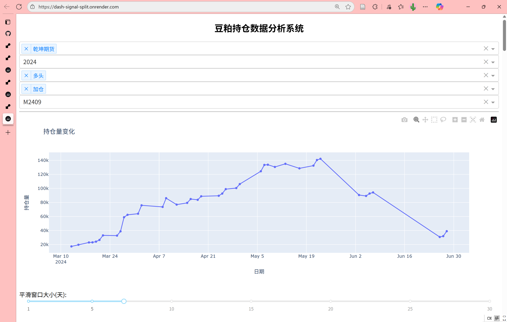
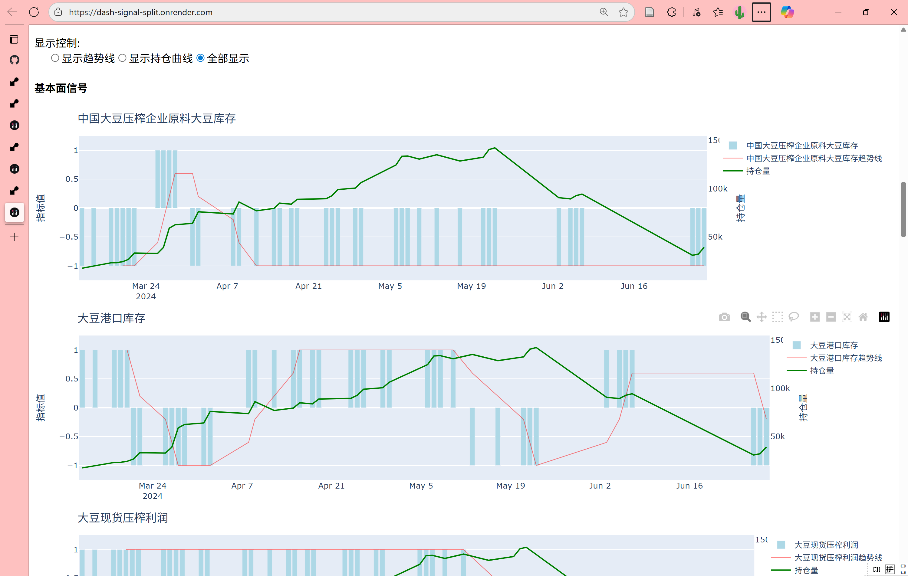

# Dash Signal Split

## Overview

This Dash application provides a detailed breakdown of individual signals affecting position changes in soymeal futures. Analysts can isolate specific signals to evaluate their influence on trading behavior.

## Features
- Split visualization of technical and fundamental signals.
- Interactive charts with selectable signal groups.
- Supports filtering by broker, year, and contract.
- Enables deep-dive analysis into signal contribution.

## Technology Stack
- Python, Dash, Plotly, Pandas, NumPy
- Hosted on Render for internal departmental use.

## Installation & Usage
1. Clone the repository: git clone https://github.com/cynikjinchen/dash-signal-overlay.git
2. Install dependencies: pip install -r requirements.txt
3. Run the app: python app.py

## Data
- Signals derived from LDC internal datasets, incorporating both technical and fundamental indicators.
- Designed to facilitate quantitative analysis of broker position changes.

